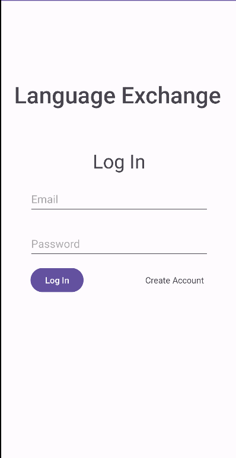

# Language Exchange App

Welcome to the Language Exchange App! This Android application allows users to sign up as volunteers to teach a specific language or sign up as learners to schedule language learning sessions with volunteers.

## Features

- **User Authentication:** Users can sign up and log in securely to access the app's features.

- **Volunteer Registration:** Individuals can register as language teachers/volunteers, specifying the languages they can teach.

- **Learner Registration:** Users interested in learning a language can sign up and browse available volunteers.

- **Appointment Scheduling:** Learners can schedule appointments with volunteers to engage in language exchange sessions.

## Screenshots

### Prerequisites

- Android Studio installed
- Android device or emulator

### Usage
- Launch the app and sign up or log in.
- Choose your role as a volunteer or learner.
- Volunteers: Set the languages you can teach.
- Learners: Browse available volunteers and schedule appointments  for language exchange.
